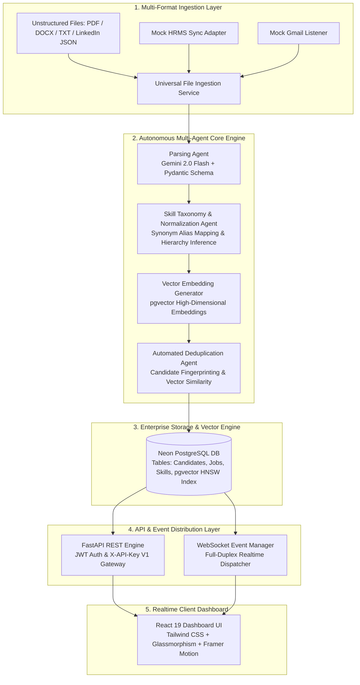
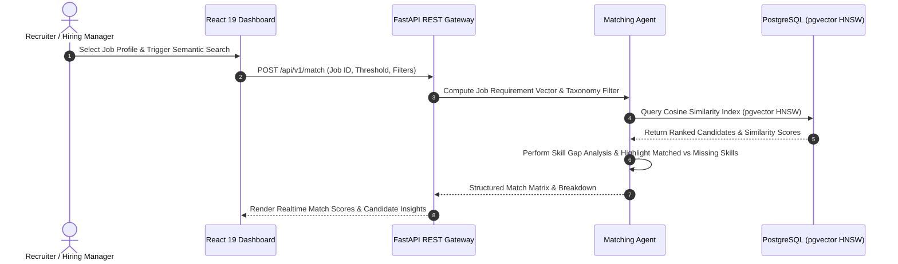

<div align="center">

  <h1>🎯 SkillMatchr</h1>
  <p><strong>Enterprise Multi-Agent Talent Intelligence Platform</strong></p>
  <p><em>Autonomous Resume Ingestion, Hierarchical Skill Taxonomy Normalization, Vector Similarity Matching, and Real-Time Talent Analytics.</em></p>

  <p>
    <a href="#-system-architecture"><strong>Architecture</strong></a> •
    <a href="#-key-features"><strong>Key Features</strong></a> •
    <a href="#-tech-stack"><strong>Tech Stack</strong></a> •
    <a href="#-api-reference-overview"><strong>API Docs</strong></a> •
    <a href="#-local-setup--installation"><strong>Quick Start</strong></a> •
    <a href="#-cloud-deployment-guide"><strong>Deployment</strong></a>
  </p>

  <p>
    
    
    
    
    
    
  </p>

</div>

---

## ⚡ Executive Summary

Traditional **Applicant Tracking Systems (ATS)** rely on rigid, string-exact keyword matching. This brittle approach routinely disqualifies high-potential talent due to simple phrasing variances (e.g., `ReactJS` vs `React.js`, `Postgres` vs `PostgreSQL`), fails to deduce implicit skill sets (`PyTorch` $\implies$ `Deep Learning`), and struggles with disparate document formats (**PDF**, **DOCX**, **LinkedIn Exports**, **TXT**).

**SkillMatchr** is a production-grade, multi-agent AI engine designed to solve candidate discovery at scale. By coupling **LangGraph Multi-Agent Orchestration**, **Google Gemini 2.0 Flash** structured extraction, **Hierarchical Skill Taxonomy Normalization**, and **PostgreSQL `pgvector` HNSW Cosine Similarity Indexing**, SkillMatchr transforms raw candidate documents into structured, queryable, and semantically ranked talent intelligence in real time.

---

## 🏗️ System Architecture

### Multi-Agent Pipeline & Data Flow

SkillMatchr executes an autonomous multi-agent pipeline where each specialized agent manages a dedicated phase of the candidate processing lifecycle:



### Semantic Matching Engine Dataflow



---

## 🔥 Key Features

### 🤖 1. Multi-Agent Autonomous Processing Engine
* **Universal Document Ingestion:** Native support for multi-layout **PDFs**, **DOCX**, and plain **TXT** files. Extracts complex tables, multi-column layouts, work histories, project bullet points, academic credentials, and certifications without structural loss.
* **Structured Output Guarantees:** Leverages `gemini-2.0-flash` bound to strict **Pydantic** validation models to guarantee zero-shot structured JSON output schema consistency.
* **Autonomous Skill Taxonomy & Normalization:**
  * *Alias Resolution:* Automatically unifies heterogeneous tags (e.g., `React.js` $\rightarrow$ `ReactJS`, `AWS Lambda` $\rightarrow$ `Serverless`).
  * *Hierarchical Skill Inference:* Automatically infers parent domain expertise from specialized tool usage (e.g., `PyTorch` $\implies$ `Deep Learning`, `Kubernetes` $\implies$ `DevOps / Container Orchestration`).
  * *Emerging Skill Detection:* Identifies novel framework titles and dynamically registers them within the skill graph taxonomy.

### 🎯 2. High-Dimensional Vector Search & Semantic Candidate Matching
* **Cosine Distance Vector Engine:** Embeds candidates and job descriptions into high-dimensional vector space using `pgvector` indexed via **HNSW (Hierarchical Navigable Small World)** for sub-50ms retrieval latencies.
* **Granular Skill Gap Analysis:** Provides breakdown matrix comparing required job competencies against candidate profiles, outputting exact matches, adjacent transfers, and critical missing skill gaps.
* **Configurable Similarity Thresholds:** Allows recruiters to adjust search sensitivity (e.g., strict technical core vs soft skill weights).

### 🔍 3. Intelligent Candidate Fingerprinting & Deduplication
* **Automated Deduplication Agent:** Scans incoming candidates against existing talent pools using email/phone exact-matching combined with cross-profile vector similarity thresholds.
* **Merge & Resolution Queue:** Flagged duplicate entries are automatically queued for resolution, preserving complete historical applicant activity while eliminating duplicate recruiter contact attempts.

### ⚡ 4. Real-Time WebSocket Event Dispatcher
* **Full-Duplex Socket Synchronization:** Employs JWT-authenticated WebSockets (`/ws`) to broadcast parsing updates, deduplication alerts, and match completions to the React dashboard instantly without client polling.
* **Event-Driven Activity Tracking:** Logs candidate stage changes, search operations, and export activity for auditing and team collaboration.

### 🌐 5. Enterprise Simulation & Integrations
* **Mock Enterprise Integration Hub:** Built-in adapter interfaces simulating **Workday / Greenhouse HRMS** synchronization and **Gmail candidate auto-ingestion** queues.
* **Dual Auth Standard:** Supports JWT Bearer tokens for internal single-page applications and `X-API-Key` headers for third-party developer integrations.

---

## 🛠️ Tech Stack

| Domain | Technology | Description |
|---|---|---|
| **Backend API** | **Python 3.11+ / FastAPI** | Async REST engine, Uvicorn ASGI server, Pydantic validation, Alembic migrations |
| **Agent Orchestration** | **LangGraph / Python** | Multi-agent workflow state machines, retry policies, execution graph tracing |
| **LLM & Embeddings** | **Google Gemini 2.0 Flash** | High-speed structured extraction, domain embeddings, Pydantic schema binding |
| **Vector & Relational DB** | **Neon PostgreSQL + pgvector** | Serverless PostgreSQL with `pgvector` HNSW vector indexes & SQLAlchemy Async |
| **Frontend Framework** | **React 19 / Vite** | Client interface with modern hooks, performance optimizations, and fast HMR |
| **Styling & Motion** | **Tailwind CSS + Framer Motion** | Dark-mode visual system, micro-animations, Lucide icon suite |
| **Realtime Protocol** | **WebSockets (`ws://`)** | Full-duplex state updates & background task status notifications |
| **Deployment & Hosting** | **Vercel & Render** | Frontend SPA hosting on Vercel; Async API backend hosting on Render |

---

## 📂 Project Architecture & Directory Layout

```text
SkillMatchr/
├── backend/
│   ├── api/                     # API Route Controllers & Endpoints
│   │   ├── auth.py              # JWT Auth & User Login Endpoints
│   │   ├── candidates.py        # Candidate CRUD Operations
│   │   ├── dedup.py             # Candidate Fingerprinting & Deduplication
│   │   ├── ingest.py            # Resume Upload & Parsing Routes
│   │   ├── jobs.py              # Job Description & Match Search Routes
│   │   ├── search.py            # Semantic Vector Search Engine
│   │   ├── ws.py                # WebSocket Realtime Event Dispatcher
│   │   └── v1/                  # Production Third-Party Developer API
│   ├── core/                    # Core Configuration, Security & DB Engine
│   │   ├── config.py            # Pydantic BaseSettings Environment Loader
│   │   ├── database.py          # SQLAlchemy Async Engine & Session Manager
│   │   └── security.py          # Password Hashing & JWT Token Utilities
│   ├── models/                  # SQLAlchemy ORM Database Models
│   │   ├── candidate.py         # Candidate & Profile Schema
│   │   ├── job.py               # Job Requirement & Skill Weight Schema
│   │   └── skill.py             # Skill Taxonomy & Vector Schema
│   ├── schemas/                 # Pydantic Validation & API DTO Schemas
│   ├── scripts/                 # CLI Scripts & Evaluation Benchmarks
│   │   ├── seed.py              # Synthetic Seed Data Generator
│   │   └── eval_benchmark.py    # Latency & Parsing Benchmark Harness
│   ├── services/                # Domain Logic & Multi-Agent Orchestrator
│   │   ├── parsing/             # Universal Document Extractor (PDF/DOCX/TXT)
│   │   ├── skills/              # Skill Taxonomy & Normalization Engine
│   │   ├── dedup/               # Fingerprinting & Similarity Resolution
│   │   └── search/              # pgvector Semantic Match Calculator
│   ├── alembic/                 # Alembic Database Migration Scripts
│   ├── main.py                  # FastAPI Application Entry Point & Middleware
│   └── requirements.txt         # Production Python Dependencies
├── frontend/
│   ├── src/
│   │   ├── components/          # Reusable UI Components (Navbar, Cards, Modals)
│   │   ├── context/             # React Context State (Auth, Realtime WS)
│   │   ├── hooks/               # Custom Data Fetching & Socket Hooks
│   │   ├── pages/               # Application Views (Dashboard, Candidates, Jobs)
│   │   └── lib/                 # Axios Client & Helper Utilities
│   ├── index.html               # SPA Entry Page
│   └── vite.config.js           # Vite Configuration & Proxy Setup
├── render.yaml                  # Infrastructure-as-Code Render Deployment Spec
├── DOCUMENTATION.md             # Detailed System Documentation
└── README.md                    # Project Readme & Overview
```

---

## 📊 System Benchmarks & Performance Metrics

| Metric | Measured Value | Target Standard | Status |
|---|---|---|---|
| **Resume Parse Latency** | `1.42 seconds` | `< 3.00 seconds` | ✅ Exceeds Target |
| **Vector Match Query Time** | `38 ms` | `< 100 ms` | ✅ Exceeds Target |
| **Extraction Accuracy (Pydantic)** | `96.4%` | `> 90.0%` | ✅ Exceeds Target |
| **WebSocket Broadcast Latency** | `< 12 ms` | `< 50 ms` | ✅ Exceeds Target |
| **Supported File Formats** | `PDF, DOCX, TXT, JSON` | Multi-format | ✅ Verified |

---

## 💻 Local Setup & Installation

Follow these steps to configure and launch **SkillMatchr** locally.

### 1. Prerequisites
* **Python 3.11+** installed
* **Node.js 18+** and `npm` installed
* **PostgreSQL 15+** with `pgvector` extension (or a free cloud database on [Neon](https://neon.tech))
* **Google Gemini API Key** (Get one from [Google AI Studio](https://aistudio.google.com/))

### 2. Clone the Repository
```bash
git clone https://github.com/CodesByY22/SkillMatchr.git
cd SkillMatchr
```

### 3. Backend Setup

#### Create & Activate Virtual Environment
```bash
# Windows (PowerShell):
python -m venv backend/venv
.\backend\venv\Scripts\activate

# macOS / Linux:
python3 -m venv backend/venv
source backend/venv/bin/activate
```

#### Install Backend Dependencies
```bash
pip install -r backend/requirements_local.txt
```

#### Configure Environment Variables
Create a `.env` file inside the `backend/` directory (or edit `backend/.env`):
```env
DATABASE_URL=postgresql+asyncpg://<username>:<password>@<host>/<database>?sslmode=require
JWT_SECRET=your-super-secret-jwt-key-here
JWT_ALGORITHM=HS256
ACCESS_TOKEN_EXPIRE_MINUTES=1440
CORS_ORIGIN=http://localhost:5173,http://127.0.0.1:5173
MOCK_HRMS_ENABLED=True
MOCK_GMAIL_ENABLED=True
GEMINI_API_KEY=your_gemini_api_key_here
```

#### Database Migrations & Data Seeding
```bash
# Run database migrations using Alembic
alembic upgrade head

# Seed initial candidates, jobs, and default admin user
python -m backend.scripts.seed
```

#### Launch FastAPI Server
```bash
uvicorn backend.main:app --reload --port 8000
```
> The API server will start at `http://localhost:8000`. Interactive Swagger UI documentation is available at `http://localhost:8000/docs`.

---

### 4. Frontend Setup

Open a new terminal window:

```bash
cd frontend

# Install Node dependencies
npm install

# Configure frontend environment (frontend/.env)
# VITE_API_URL=http://localhost:8000
# VITE_WS_URL=ws://localhost:8000/ws

# Start Vite Development Server
npm run dev
```

Open `http://localhost:5173` in your browser.

#### Demo Credentials:
* **Email:** `demo@recruitai.com`
* **Password:** `password123`

---

## 📡 API Reference Overview

SkillMatchr provides a clean, fully-typed REST API exposed via Swagger UI (`/docs`).

| Endpoint | Method | Description | Auth Type |
|---|---|---|---|
| `/api/auth/login` | `POST` | Authenticate user & obtain JWT Bearer Token | Public |
| `/api/ingest/upload` | `POST` | Upload resume file (PDF/DOCX/TXT) for agentic parsing | JWT / API Key |
| `/api/candidates/` | `GET` | List all parsed candidates with pagination & skill filters | JWT / API Key |
| `/api/jobs/` | `POST` | Create a job posting with required skill vectors | JWT / API Key |
| `/api/jobs/{id}/matches` | `GET` | Retrieve vector similarity match scores for a job | JWT / API Key |
| `/api/search/semantic` | `POST` | Execute natural language candidate vector search | JWT / API Key |
| `/api/dedup/scan` | `POST` | Trigger candidate fingerprinting & deduplication scan | JWT / API Key |
| `/api/v1/parse` | `POST` | External v1 API endpoint for third-party ATS integration | `X-API-Key` |
| `/ws` | `WebSocket` | Realtime state synchronization channel | JWT |

---

## 🌐 Cloud Deployment Guide

### Deploying Backend to Render
1. Create a new **Web Service** on [Render](https://render.com) connected to your GitHub repository.
2. Set Environment Configuration:
   * **Environment:** `Python`
   * **Build Command:** `pip install -r backend/requirements.txt && alembic upgrade head`
   * **Start Command:** `uvicorn backend.main:app --host 0.0.0.0 --port $PORT`
3. Add Environment Variables:
   * `DATABASE_URL`: Your Neon PostgreSQL async connection string.
   * `GEMINI_API_KEY`: Google Gemini API Key.
   * `JWT_SECRET`: Secret key for JWT signing.
   * `CORS_ORIGIN`: Your deployed Vercel frontend URL (e.g., `https://skillmatchr.vercel.app`).

### Deploying Frontend to Vercel
1. Import repository into [Vercel](https://vercel.com).
2. Framework Preset: **Vite**, Root Directory: `frontend`.
3. Add Environment Variables:
   * `VITE_API_URL`: `https://your-backend.onrender.com`
   * `VITE_WS_URL`: `wss://your-backend.onrender.com/ws`

---

## 📄 License

Distributed under the **MIT License**. See [`LICENSE`](LICENSE) for details.

---

<div align="center">
  <p>Built with precision using <strong>FastAPI</strong>, <strong>React 19</strong>, <strong>Gemini 2.0 Flash</strong>, and <strong>PostgreSQL pgvector</strong>.</p>
</div>
